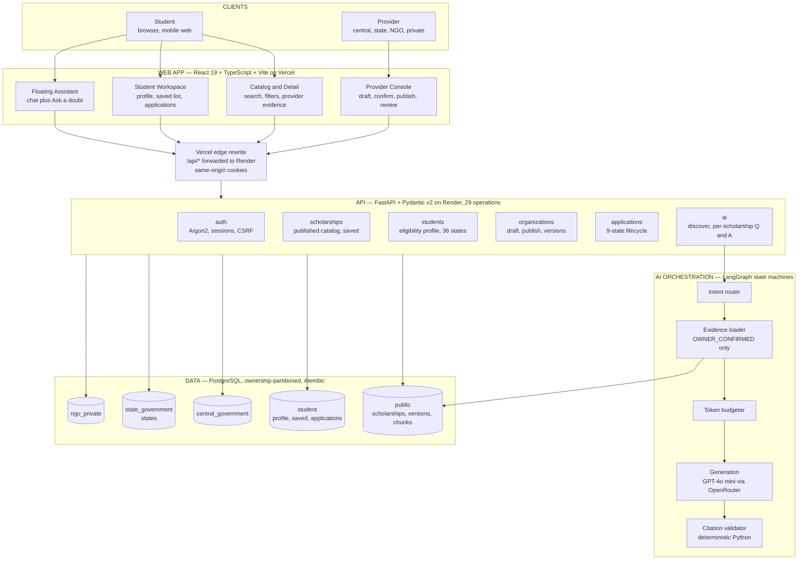
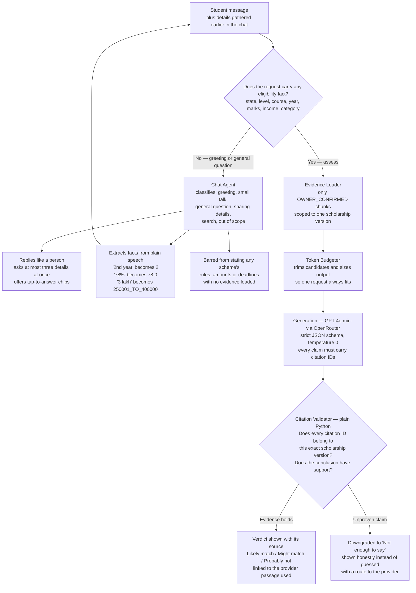
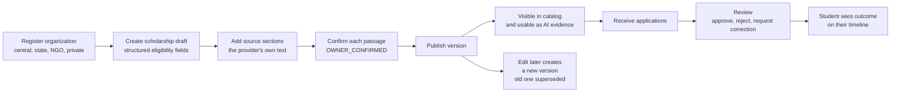
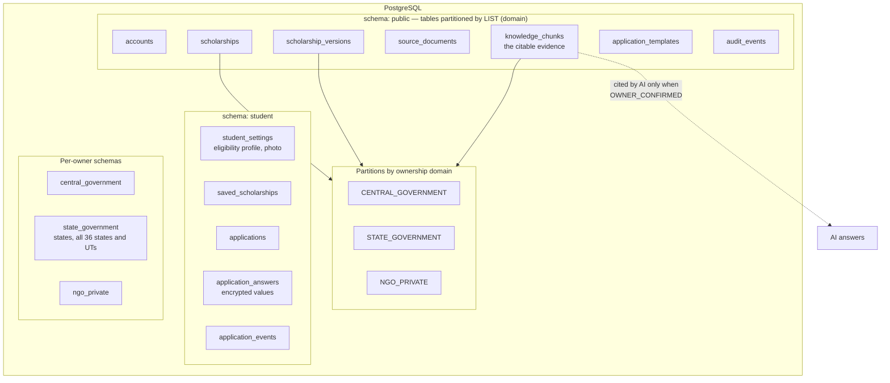
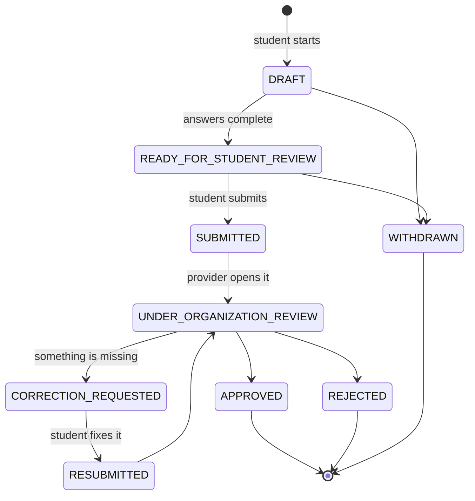

# ScholarSaathi

**One trusted scholarship journey — from discovery to decision.**

Built for **Build What Moves India**. We are fixing the part of the scholarship system that quietly costs students the most: not the money, but the confusion.

| | |
| --- | --- |
| **Live app** | https://scholarsaathi-two.vercel.app |
| **Live API** | https://scholarsaathi.onrender.com |
| **API docs** | https://scholarsaathi.onrender.com/docs |

---

## Demo Credentials

Sign in on the live app to walk through both sides of the platform.

### Student

| Field | Value |
| --- | --- |
| Email | `krishnaagrawal0706@gmail.com` |
| Password | `12345678` |

Sign in at [`/login/student`](https://scholarsaathi-two.vercel.app/login/student), then browse the catalog, chat with the assistant, complete your profile, save scholarships and prepare an application.

### Provider

| Field | Value |
| --- | --- |
| Email | `central.publisher@demo.scholarsaathi.local` |
| Password | `Demo@ScholarSaathi2026` |

Sign in at [`/login/organization`](https://scholarsaathi-two.vercel.app/login/organization) to see the provider console and review applications.

> Shared demo accounts on synthetic data. Do not store personal information in them, and do not reuse these passwords anywhere else.

---

## Table of Contents

1. [The problem we are solving](#1-the-problem-we-are-solving)
2. [Our solution](#2-our-solution)
3. [System architecture](#3-system-architecture)
4. [The evidence-grounded AI pipeline](#4-the-evidence-grounded-ai-pipeline)
5. [Student workflow](#5-student-workflow)
6. [Provider workflow](#6-provider-workflow)
7. [Data ownership model](#7-data-ownership-model)
8. [Application lifecycle](#8-application-lifecycle)
9. [How this benefits Indian students](#9-how-this-benefits-indian-students)
10. [Tech stack](#10-tech-stack)
11. [API surface](#11-api-surface)
12. [Security and privacy](#12-security-and-privacy)
13. [Project structure](#13-project-structure)
14. [What is built vs what is next](#14-what-is-built-vs-what-is-next)

---

## 1. The problem we are solving

India's **National Scholarship Portal (NSP)** at [scholarships.gov.in](https://scholarships.gov.in/) is a genuine achievement. It describes itself as a one-stop solution covering the path from student application through processing, sanction and disbursal ([NSP About](https://scholarships.gov.in/aboutUs)). Crores of students depend on it.

But a portal that *hosts* schemes is not the same thing as a portal that *explains* them. NSP is essentially a very large, very formal submission desk. What it does not do is answer the question every student actually starts with: **"which of these am I eligible for, and what will it need from me?"**

### Where it breaks down for a student

**Scheme sprawl with no personal filter.** NSP carries schemes from Central Ministries, State Governments, UGC, AICTE and other agencies ([NSP Institute FAQ](https://scholarships.gov.in/public/FAQ/NSPInstituteFAQV1.7.pdf)). Each has its own eligibility logic, income ceilings, category rules, course lists and domicile conditions. A student in their second year of a B.Tech in Odisha has no way to ask the portal "show me only what fits me." They read scheme names and guess.

**Rules live inside PDFs.** The real conditions sit in per-scheme guideline PDFs and FAQ documents, one per ministry, each formatted differently. A student must open several documents and mentally cross-reference them against their own marks, family income slab and category.

**The rules themselves change by year.** From AY 2026–27, NSP states that a student may apply for one merit-based scheme plus one or more welfare-based schemes, subject to each scheme's criteria ([NSP](https://scholarships.gov.in/)). Policy shifts like this are announced as notices. If you read last year's advice, you are already wrong.

**Silent, procedural rejection.** Applying wrong is punished rather than prevented. NSP warns that renewal-eligible students who instead apply as fresh will have the duplicate rejected ([NSP login](https://scholarships.gov.in/payl/loginPage.action)). Students with disabilities must first give consent through the UDID portal or their NSP submission simply cannot go through ([NSP](https://scholarships.gov.in/)). These are learnable rules that a student only discovers after failing.

**Fragmented help.** When something goes wrong, there is no single desk. Grievances about verification, disbursement, eligibility or cut-off dates are directed to the nodal ministry or department that owns that particular scheme ([NSP grievance guidance](https://nsp.gov.in/NSPADMIN/RTIContact)). The student is now doing routing work.

**Deadline pressure meets load.** NSP's own guidance to applicants acknowledges that heavy concurrent usage can mean slow response and delayed submission ([NSP scheme FAQ](https://scholarships.gov.in/public/schemeGuidelines/tribalfellowshipfaq.pdf)). Everyone applies at the end. The window is when the system is slowest.

> *Sources above are official NSP and Government of India pages. Content was rephrased for compliance with licensing restrictions.*

## 2. Our solution

ScholarSaathi is a scholarship platform with two halves that reinforce each other:

- **Providers own their own truth.** Central, state, NGO and private providers publish structured scholarship records and explicitly confirm the source passages the platform is allowed to quote. Nothing is scraped.
- **Students get an assistant that can only speak from those confirmed passages.** Every meaningful claim carries a citation to a specific provider passage on a specific scholarship version. Claims that fail that check are downgraded to an honest "not enough to say" before the student ever sees them.

Three principles run through the build:

| Principle | What it means in code |
| --- | --- |
| **Evidence before answers** | Claims must cite `OWNER_CONFIRMED` passages, validated in Python after generation |
| **No cross-scheme contamination** | Evidence is scoped per scholarship version; citation IDs from another scheme are rejected |
| **Honest uncertainty** | Missing or conflicting evidence returns "cannot determine", never a guess |

---

## 3. System architecture



**Why the edge rewrite matters.** The browser only ever talks to its own origin. Vercel forwards `/api/*` to Render, so the session cookie stays first-party and `SameSite=Strict` remains usable. No CORS credential juggling, no third-party cookie problems.

---

## 4. The evidence-grounded AI pipeline

This is the core of the project. **The model drafts; deterministic code decides what a student is allowed to see.**



### The three guardrails that matter

**1. The router prevents theatre.** Before this existed, typing "hello" ran the full assessment against every scholarship in the catalog. With zero facts about the student, the model could not conclude anything, so the student got a wall of identical "Could not determine" cards. Now a greeting is answered as a greeting, with no cards and no wasted tokens.

**2. The validator is not the model.** After generation, plain Python checks every citation ID against the set of passages actually loaded for that specific scholarship version. A claim citing another scheme's passage, or a conclusion with no supporting claim at all, is replaced with "not enough to say". **The model cannot vote itself through this gate.** This is what structurally prevents cross-scheme contamination.

**3. Conversation turns carry no evidence, so they are barred from rule-making.** During a chat turn the model has no provider passages loaded. It is therefore explicitly forbidden to state any scheme's eligibility rule, benefit amount or deadline. It can explain how scholarships work in general and name what is available, then route the student into a specific scholarship where citations exist.

### It builds a profile out of ordinary sentences

Both agents extract structured facts from natural speech, and the assistant accumulates them across turns. A real six-message conversation:

| Student says | Extracted | Mode |
| --- | --- | --- |
| "hi" | — | Conversation |
| "what can you help me with?" | — | Conversation |
| "I'm doing BTech in Odisha" | `state: OD`, `course: BTECH`, `education_level: UNDERGRADUATE` | Conversation |
| "2nd year" | `course_year: 2` | **Assessment** |
| "my marks are 78%" | `marks_percentage: 78.0` | Assessment |
| "family income is around 3 lakh" | `family_income_range: 250001_TO_400000` | Assessment |

No form. Six short messages and the assistant has a complete eligibility profile, showing readable pills for what it understood — "Odisha", "B.Tech", "Year 2", "78% marks", "Income ₹2.5–4L" — so a student can see and correct its reading.

### Ask a doubt about one specific scholarship

On any scholarship page, students can ask questions answered strictly from that provider's published text, with the exact section shown. Verified live against seeded data:

| Question | Result |
| --- | --- |
| What are the eligibility requirements? | Answered, cites *Eligibility guidance* |
| Which documents are required? | Answered, cites *What the application asks* |
| What is the benefit amount? | Answered, cites *Fellowship package* |
| When is the application deadline? | Answered, cites *Deadline and review* |
| How do I apply? | Answered, cites two sections |
| How is the selection done? | **`MORE_INFORMATION_NEEDED`** — provider never published it |

That last row is the feature, not a gap. The provider had not published selection criteria, so the assistant declined rather than inventing a plausible process.

---

## 5. Student workflow

```mermaid
flowchart LR
    A["Land on catalog<br/>no login needed"] --> B["Ask the assistant<br/>plain language, any language"]
    B --> C["Assistant gathers details<br/>across a few short messages"]
    C --> D["Verdicts with sources<br/>likely, might, probably not"]
    D --> E["Open a scholarship<br/>read provider passages"]
    E --> F["Ask a doubt<br/>documents, dates, eligibility"]
    F --> G["Save to shortlist"]
    G --> H["Create account<br/>only needed to apply"]
    H --> I["Profile saved once<br/>reused for every future search"]
    I --> J["Start application<br/>prefilled from profile"]
    J --> K["Submit to provider"]
    K --> L["Track status<br/>event timeline"]
    L --> M["Provider decision"]
```



Discovery and Q&A are deliberately **available without an account**. A student should not have to register to find out whether anything fits them. Sign-in is required only to store a shortlist or submit an application.

---

## 6. Provider workflow



**Confirmation is the hinge.** A passage becomes AI-quotable only when the owning organization marks it `OWNER_CONFIRMED`. Unconfirmed text is invisible to the assistant. This is what makes provider accountability real rather than a claim: the provider decides what the AI may say about their own scheme.

---

## 7. Data ownership model

Scholarship data is partitioned by who owns it, enforced at the database level rather than by application convention.



**Why partition by ownership at all?** Because the failure we most need to prevent is one provider's rule leaking into another provider's answer. Composite foreign keys carry the domain, so a row physically cannot reference a scholarship version belonging to a different owner. The isolation the AI depends on is a schema guarantee, not a `WHERE` clause someone might forget.

Ownership domains: `STUDENT`, `CENTRAL_GOVERNMENT`, `STATE_GOVERNMENT`, `NGO_PRIVATE`.
Organization types: `CENTRAL_GOVERNMENT`, `STATE_GOVERNMENT`, `PRIVATE_COMPANY`, `NGO`.

---

## 8. Application lifecycle



`CORRECTION_REQUESTED` is the state that matters most for the problem we set out to fix. Instead of silent procedural rejection, a provider can say what is wrong and the student can repair it. Every transition writes a timestamped event, so the student always sees where their application stands and why.

Publication states run in parallel: `DRAFT`, `PUBLISHED`, `PAUSED`, `EXPIRED`, `ARCHIVED`, `SUPERSEDED`.

---

## 9. How this benefits Indian students

**Eligibility becomes a conversation, not a research project.** "I'm doing BTech in Odisha, 2nd year, 78%" replaces opening several ministry PDFs and cross-referencing them by hand.

**Wrong answers are structurally harder to produce.** A verdict that cannot cite a provider passage is downgraded before display. A student is told "not enough to say, here is the provider's page" rather than being confidently misled. For a decision with a hard deadline, that honesty is the whole value.

**Every claim is auditable.** Each answer shows the exact provider section behind it. A student can verify rather than trust, and can carry that citation to their institute or the provider's helpdesk.

**Wasted applications drop.** Seeing "probably not a match — this fellowship is for women only, which does not match your profile" *before* assembling documents saves weeks. Conversely, "likely match" with the reason attached gives a student the confidence to actually apply.

**Details are entered once.** State, course, year, marks, income and category persist to the profile and prefill every later search and application, instead of being retyped per scheme.

**Language is not a barrier.** The assistant answers in the student's preferred language while the underlying provider evidence stays in its original form, so nothing is lost in translation.

**No login wall on discovery.** A student can find out whether anything fits them before creating an account.

**Providers get reached by the right students.** Structured eligibility plus confirmed evidence means well-matched applicants and fewer incomplete submissions to process.

---

## 10. Tech stack

**Frontend**

| Package | Version |
| --- | --- |
| react / react-dom | 19.2.8 |
| typescript | 7.0.2 |
| vite | 8.2.2 |
| react-router-dom | 7.18.2 |
| tailwindcss | 4.3.3 |
| framer-motion | 13.1.1 |

**Backend**

| Package | Version |
| --- | --- |
| fastapi | 0.141.1 |
| uvicorn[standard] | 0.52.4 |
| SQLAlchemy | 2.0.52 |
| alembic | 1.19.1 |
| psycopg[binary] | 3.3.4 |
| pydantic-settings | 2.15.0 |
| argon2-cffi | 25.1.0 |
| langchain-openai, langgraph | latest |

**AI and infrastructure**

- **Model:** `openai/gpt-4o-mini` via [OpenRouter](https://openrouter.ai)
- **Orchestration:** LangGraph state machines with strict JSON-schema structured output
- **Database:** PostgreSQL, ownership-partitioned, Alembic migrations (head `20260829_0003`)
- **Hosting:** Vercel (frontend), Render (API), managed PostgreSQL

---

## 11. API surface

29 operations. Full interactive docs at [`/docs`](https://scholarsaathi.onrender.com/docs).

**Authentication**

```
POST   /api/auth/student/register          POST   /api/auth/student/login
POST   /api/auth/organization/register     POST   /api/auth/organization/login
GET    /api/auth/me                        POST   /api/auth/logout
```

**Public catalog**

```
GET    /api/scholarships                   GET    /api/scholarships/{id}
GET    /api/states
GET    /api/health/live                    GET    /api/health/ready
```

**AI**

```
POST   /api/ai/discover                                  conversation + eligibility assessment
POST   /api/ai/scholarships/{id}/questions               Ask a doubt, cited answers
```

**Student**

```
GET    /api/student/profile                PUT    /api/student/profile
GET    /api/student/saved-scholarships
POST   /api/student/saved-scholarships/{id}
DELETE /api/student/saved-scholarships/{id}
GET    /api/student/applications
POST   /api/scholarships/{id}/applications
GET    /api/applications/{id}              PUT    /api/applications/{id}/answers
POST   /api/applications/{id}/submit
```

**Provider**

```
GET    /api/organizations/me
GET    /api/organizations/me/scholarships  POST   /api/organizations/me/scholarships
POST   /api/organizations/me/scholarship-versions/{id}/publish
GET    /api/organizations/me/applications
POST   /api/organizations/me/applications/{id}/status
```

---

## 12. Security and privacy

- **Passwords:** Argon2id hashing (`argon2-cffi`); plaintext is never stored or logged
- **Sessions:** HttpOnly, `Secure`, `SameSite=Strict` cookie holding a hashed opaque token
- **CSRF:** double-submit token compared with `hmac.compare_digest` on every mutating request
- **Ownership checks:** every provider route resolves an active membership before touching data
- **Rate limits:** 12 AI requests per minute per client, 5 registrations per 15 minutes
- **Security headers:** `X-Content-Type-Options`, `X-Frame-Options`, `Referrer-Policy`, `Permissions-Policy`
- **No-store:** applied to AI, application, session and student-profile responses
- **Application answers:** stored in a dedicated encrypted column
- **Sensitive data refused by design:** the assistant is instructed never to request or echo Aadhaar, PAN, bank details, phone numbers, passwords or OTPs, and the UI says so on every screen that accepts input
- **Production guardrails:** startup validation rejects a weak `APP_SECRET_KEY`, non-secure cookies, or non-HTTPS CORS origins when `APP_ENV=production`

---

## 13. Project structure

```
scholarsaathi/
├── backend/
│   ├── alembic/versions/          three migrations, head 20260829_0003
│   └── app/
│       ├── agents/scholarship_ai.py    LangGraph graphs, prompts, citation validator
│       ├── api/                        auth, scholarships, students, organizations,
│       │                               applications, discovery
│       ├── services/ai_discovery.py    intent routing, evidence loading, token budget
│       ├── core/config.py              typed settings with production validation
│       ├── models.py                   18 tables across four ownership schemas
│       ├── schemas.py                  Pydantic request/response contracts
│       ├── security.py                 Argon2, sessions, CSRF
│       ├── rate_limit.py               sliding-window limiter
│       └── seed.py                     synthetic scholarships and demo accounts
├── frontend/src/
│   ├── components/
│   │   ├── EligibilityAssistant.tsx    the floating chat assistant
│   │   └── ScholarshipCard.tsx
│   ├── context/                        AuthContext, AssistantContext
│   ├── pages/                          catalog, detail, student workspace,
│   │                                   profile, saved, applications, provider console
│   ├── lib/api.ts                      fetch wrapper with CSRF handling
│   └── types.ts
├── render.yaml                    API deployment
└── frontend/vercel.json           web deployment and /api/* rewrite
```

---

## 14. What is built vs what is next

**Working today**

- Provider publishing with source confirmation and version supersession
- Public catalog with search and filters, no login required
- Conversational assistant with intent routing, fact extraction and cited verdicts
- Per-scholarship Ask a doubt with provider-section citations
- Persistent student eligibility profile with photo, prefilling searches
- Saved shortlist, full application lifecycle with event timeline
- Provider review console with approve, reject and request-correction
- Four-domain ownership isolation enforced by schema

**Honest limitations**

- Scholarship content is **synthetic seed data** modelled on real scheme structures. We have not ingested live NSP scheme data; that needs provider onboarding or an official data agreement.
- No live payment or disbursal integration. Disbursal stays with the actual scheme owner.
- Document upload for applications is not built; providers verify documents through their own process.
- English-first UI. The assistant answers in the student's preferred language, but the interface chrome is not yet fully localised.

**Next**

- Onboard real providers, starting with state-level and NGO schemes where the confirmation workflow is easiest to adopt
- Deadline reminders and renewal-versus-fresh detection, the exact trap that silently rejects students today
- Full UI localisation across major Indian languages
- Institute-side verification view to close the loop NSP routes through colleges

---

## Vision

Make every scholarship opportunity understandable, verifiable and accessible, so that a student's future is not limited by fragmented information or a confusing process.

A scholarship a student never understood is a scholarship that never existed for them. That is the gap we are closing.
