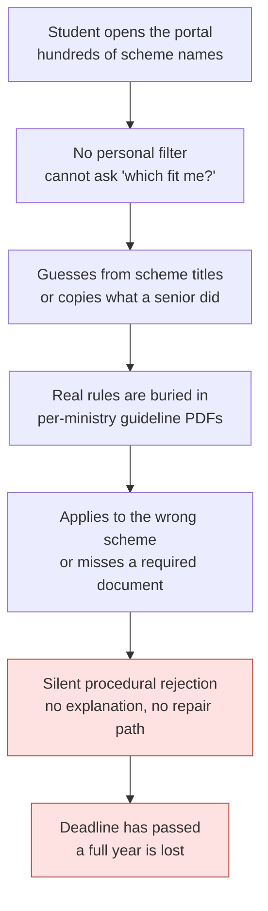
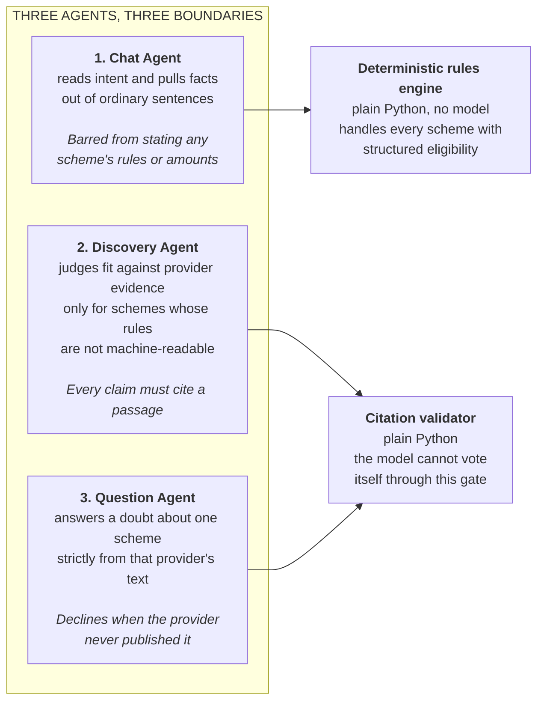
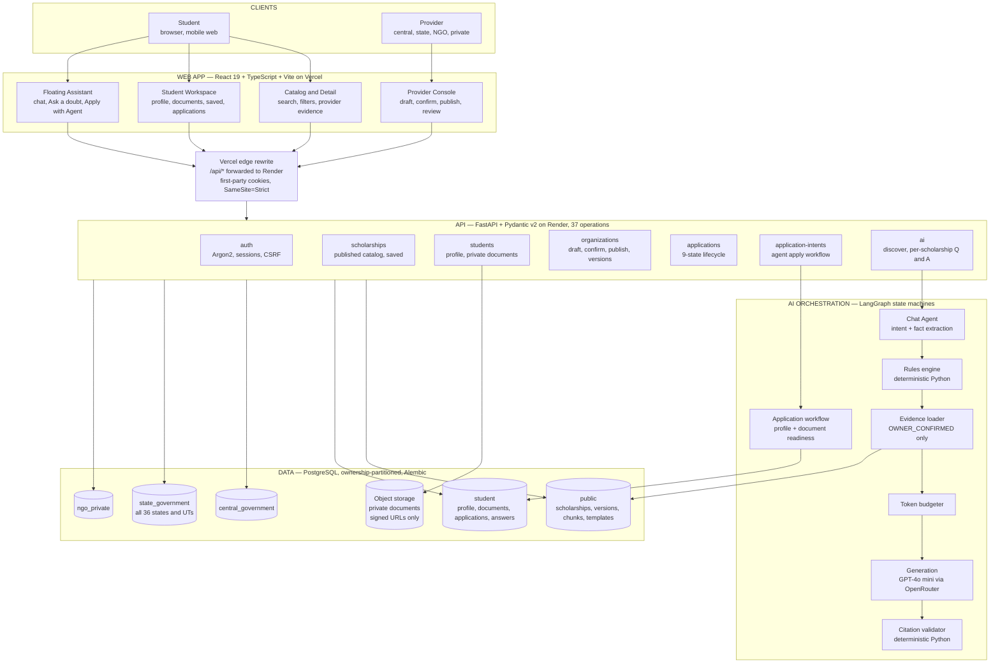
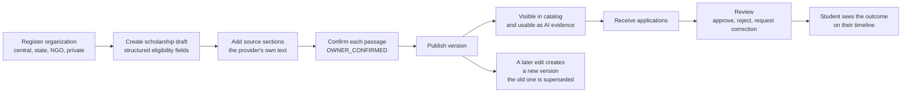
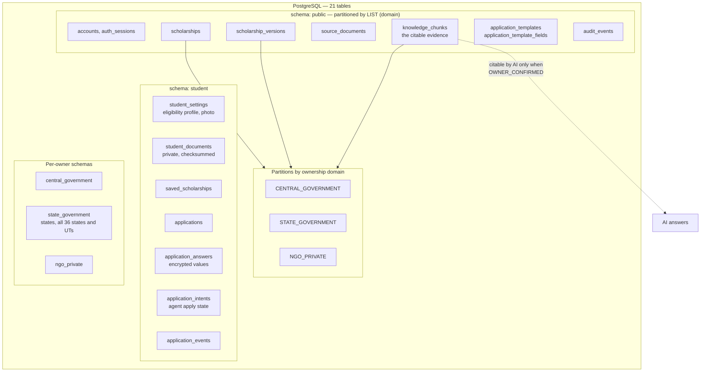

# ScholarSaathi

**A redesign proposal for India's National Scholarship Portal — from a submission desk to a guided journey.**

NSP already does the hard part: it hosts the schemes, moves the money, and connects ministries, states, institutes and banks. What it does not do is stand next to the student and say *"these four are for you, this one is not, and here is exactly what it will ask you for."*

That missing person is what we built. Not a replacement for NSP — a guidance layer that could sit on top of it.

| | |
| --- | --- |
| **Live app** | https://scholarsaathi-two.vercel.app |
| **Live API** | https://scholarsaathi.onrender.com |
| **API docs** | https://scholarsaathi.onrender.com/docs |

Built for **Build What Moves India**.

---

## Demo Credentials

### Student

| Field | Value |
| --- | --- |
| Email | `krishnaagrawal0706@gmail.com` |
| Password | `12345678` |

Sign in at [`/login/student`](https://scholarsaathi-two.vercel.app/login/student).

### Provider — Central Government

| Field | Value |
| --- | --- |
| Email | `publisher.central@scholarsaathi.local` |
| Password | `Demo@ScholarSaathi2026` |

Sign in at [`/login/organization`](https://scholarsaathi-two.vercel.app/login/organization). This account owns *National Education Scholarship Directorate*. A second central account, `publisher.goi@scholarsaathi.local`, owns *National Scholarship Mission*. Same password.

> Shared demo accounts on synthetic data. Do not store personal information in them, and do not reuse these passwords anywhere else.

---

## Table of Contents

1. [The real problem: nobody tells the student anything](#1-the-real-problem-nobody-tells-the-student-anything)
2. [What we are proposing NSP should become](#2-what-we-are-proposing-nsp-should-become)
3. [How the AI agents actually help](#3-how-the-ai-agents-actually-help)
4. [Complete system architecture](#4-complete-system-architecture)
5. [The agent workflow, end to end](#5-the-agent-workflow-end-to-end)
6. [Student journey](#6-student-journey)
7. [Provider journey](#7-provider-journey)
8. [Data ownership model](#8-data-ownership-model)
9. [Application lifecycle](#9-application-lifecycle)
10. [Who benefits, and how](#10-who-benefits-and-how)
11. [Tech stack](#11-tech-stack)
12. [API surface](#12-api-surface)
13. [Security and privacy](#13-security-and-privacy)
14. [Project structure](#14-project-structure)
15. [Built vs next](#15-built-vs-next)

---

## 1. The real problem: nobody tells the student anything

India's [National Scholarship Portal](https://scholarships.gov.in/) describes itself as a one-stop solution covering student application through processing, sanction and disbursal ([NSP About](https://scholarships.gov.in/aboutUs)). Crores of students depend on it. The plumbing works.

The **guidance** does not exist. A portal that *hosts* schemes is not a portal that *explains* them. NSP is a very large, very formal submission desk, and it assumes the student already knows which desk to walk up to.

### The chain that ends in rejection

A student's failure is almost never about merit. It is a sequence of small, avoidable, invisible errors:



Each link is documented behaviour, not speculation:

**Scheme sprawl with no personal filter.** NSP carries schemes from Central Ministries, State Governments, UGC, AICTE and other agencies ([NSP Institute FAQ](https://scholarships.gov.in/public/FAQ/NSPInstituteFAQV1.7.pdf)). Each has its own income ceiling, category rule, course list and domicile condition. A second-year B.Tech student in Odisha cannot ask the portal to show only what fits them. They read names and guess.

**The rules live inside PDFs.** Conditions sit in per-scheme guideline and FAQ documents, one per ministry, each formatted differently. The student must open several and cross-reference them by hand against their own marks, income slab and category.

**The rules change by year.** From AY 2026–27, NSP states a student may apply for one merit-based scheme plus one or more welfare-based schemes, subject to each scheme's criteria ([NSP](https://scholarships.gov.in/)). Policy shifts arrive as notices. Last year's advice is already wrong.

**Rejection is silent and procedural.** Applying wrong is punished, not prevented. NSP warns that a renewal-eligible student who applies as fresh will have the duplicate rejected ([NSP login](https://scholarships.gov.in/payl/loginPage.action)). Students with disabilities must first consent through the UDID portal or the submission cannot go through ([NSP](https://scholarships.gov.in/)). These are **learnable rules that a student only discovers after failing.**

**Help is fragmented.** Grievances on verification, disbursement, eligibility or cut-offs are routed to whichever nodal ministry owns that scheme ([NSP grievance guidance](https://nsp.gov.in/NSPADMIN/RTIContact)). The student is now doing routing work.

**Deadline pressure meets peak load.** NSP's own applicant guidance acknowledges heavy concurrent usage can mean slow response and delayed submission ([NSP scheme FAQ](https://scholarships.gov.in/public/schemeGuidelines/tribalfellowshipfaq.pdf)). Everyone applies at the end, when the system is slowest.

> *Sources are official NSP and Government of India pages. Content was rephrased for compliance with licensing restrictions.*

### The one-sentence version

> A student does not fail because they were not deserving. They fail because **no one told them which scheme was theirs, and no one told them what it would ask for** — until it was too late to fix.

---

## 2. What we are proposing NSP should become

Keep the submission desk. Add the three things that are missing in front of it.

| Missing today | What we add | Why it must work this way |
| --- | --- | --- |
| No personal eligibility filter | An agent that assesses the student against **structured, machine-readable rules** | Guessing from scheme titles is the first domino |
| Rules trapped in PDFs | Providers publish **structured fields plus passages they explicitly confirm** | The portal must be able to reason about rules, not just display them |
| Silent rejection | A **correction-request state** plus a checked application before submission | A fixable mistake should never cost a year |

Two design commitments make this trustworthy enough for government use:

**Providers own their own truth.** Central, state, NGO and private providers publish structured records and explicitly mark which of their own passages the platform may quote. Nothing is scraped. A provider decides what the AI is allowed to say about their scheme.

**The assistant can only speak from confirmed passages.** Every meaningful claim carries a citation to a specific provider passage on a specific scholarship version. Claims that fail that check are downgraded to an honest "not enough to say" before a student ever sees them.

| Principle | Enforced in code as |
| --- | --- |
| **Evidence before answers** | Claims must cite `OWNER_CONFIRMED` passages, re-validated in Python after generation |
| **No cross-scheme contamination** | Evidence is scoped per scholarship version; a citation ID from another scheme is rejected |
| **Honest uncertainty** | Missing or conflicting evidence returns "cannot determine", never a guess |
| **Deterministic where it matters** | Eligibility arithmetic is plain Python, not model judgement |

---

## 3. How the AI agents actually help

There are **three agents**, each with a different job and a different safety boundary. This separation is the point: a general chat model must never be the thing that decides eligibility.



### Agent 1 — it builds the profile out of ordinary speech

No form. The student talks, and the agent extracts structure. It is explicitly tuned for how students actually type: short forms, missing capitals, Hinglish, misspellings.

| Student types | Agent extracts |
| --- | --- |
| "I'm doing btech in odisa" | `state: OD`, `course: BTECH`, `education_level: UNDERGRADUATE` |
| "2nd yr" | `course_year: 2` |
| "78%" | `marks_percentage: 78.0` |
| "around 3 lakh" | `family_income_range: 250001_TO_400000` |
| "genral" | `categories: [GENERAL]` |

That last row is a real bug we fixed. A student answering "General" to a category question was being read as asking a *general question*, so their answer was silently dropped and the search never refreshed. There are now two defences: the prompt names `GENERAL` as a real Indian social category, and a deterministic fuzzy matcher recovers it from `gen`, `genral`, `genaral`, `gneral`, `jeneral`, `unreserved` and `open`. Short ambiguous tokens like `SC` and `ST` are exact-match only, because one edit turns one into the other.

**The agent asks for everything it still needs in one turn**, then stops asking. Being asked for three details, answering them, and immediately being asked for a fourth reads like a loop and it made students abandon the chat.

### Agent 2 — it decides fit, but arithmetic is not left to a model

For any scheme whose provider published structured rules, eligibility is computed in **plain Python**: income ceilings, mark minimums, course families, domicile, category. Deterministic, auditable, free, and identical every time. A model is only consulted for schemes whose rules are not yet machine-readable, and even then its output must survive the validator.

Numeric rules are applied literally, because getting this subtly wrong is how a portal wrongly rejects someone: a student meets a minimum when their value is **greater than or equal** to it. 80% satisfies a 65% floor. A missing fact is never converted into a failed rule.

### Agent 3 — it declines rather than inventing

On any scholarship page, a student asks a doubt and gets an answer drawn only from that provider's confirmed text, with the section shown. Answers that are lists — required documents, eligibility conditions, application steps — come back **point-wise**, one item per line, rather than as a paragraph a student has to unpick.

| Question | Result |
| --- | --- |
| What are the eligibility requirements? | Answered, cites *Eligibility guidance* |
| Which documents are required? | Answered as a point-wise list, cites *What the application asks* |
| What is the benefit amount? | Answered, cites *Fellowship package* |
| When is the application deadline? | Answered, cites *Deadline and review* |
| How do I apply? | Answered, cites two sections |
| How is the selection done? | **`MORE_INFORMATION_NEEDED`** — the provider never published it |

That last row is the feature. The provider had not published selection criteria, so the assistant declined instead of inventing a plausible process. **On a decision with a hard deadline, that honesty is the entire value.**

### The agent that applies on the student's behalf

This is where a guidance layer becomes real help. The student says "apply", and an agent runs the application: it pulls their saved profile into the provider's form, checks the required documents, and reports precisely what is still missing.

Three rules govern it, because an agent acting on a student's behalf must never overreach:

**It applies to exactly what was authorized.** Clicking *Apply with Agent* on one card applies to that one scholarship. Saying "apply to all eligible" applies to all of them, in a single request. There is no batching into waves of three, which previously made one authorization look like a bulk apply and left the rest queued behind a prompt the student never asked for.

**A bare "done" resumes only what was blocked.** This was a serious bug. Document-blocked applications were being dropped from the pending map, so when a student uploaded a certificate and typed "done", the code lost its target and fell back to *every* match — starting twelve applications the student never requested. Blocked applications are now tracked whatever the reason, and the scope of an apply request is decided by the model (`ALL_MATCHES`, `PENDING`, `CURRENT`) with a deterministic fallback on the student's own wording, including `ho gaya`, `kar diya` and misspellings.

**It never accepts documents in chat.** If a document is missing, the agent names it, sends the student to their profile to upload it privately, and resumes the same application once they confirm.

---

## 4. Complete system architecture



**Why the edge rewrite matters.** The browser only ever talks to its own origin. Vercel forwards `/api/*` to Render, so the session cookie stays first-party and `SameSite=Strict` remains usable. No CORS credential juggling, no third-party cookie problems.

---

## 5. The agent workflow, end to end

```mermaid
flowchart TB
    MSG["Student message<br/>plus facts gathered earlier in this chat"]
    CHAT["<b>Chat Agent</b><br/>classifies intent, extracts facts,<br/>tolerates short forms and misspellings"]
    MSG --> CHAT

    CHAT --> RECOVER["Deterministic recovery<br/>a dropped category answer is<br/>rescued by fuzzy matching"]
    RECOVER --> FACTS{"Any usable eligibility fact,<br/>old or new?"}

    FACTS -->|"No"| REPLY["Reply like a person<br/>ask for everything still missing,<br/>in one turn, with tap-to-answer chips"]
    REPLY --> BARRED["<i>Barred from stating any scheme's<br/>rules, amounts or deadlines:<br/>no evidence is loaded on this turn</i>"]

    FACTS -->|"Yes"| CAND["Candidate query<br/>filter by state, level, course<br/>up to 60 published schemes"]
    CAND --> SPLIT{"Did the provider publish<br/>machine-readable rules?"}

    SPLIT -->|"Yes"| DET["<b>Deterministic rules engine</b><br/>income, marks, course, domicile, category<br/>plain Python, no model, no cost"]
    SPLIT -->|"No"| EV["Evidence loader<br/>OWNER_CONFIRMED chunks,<br/>scoped to one scholarship version"]

    EV --> BUD["Token budgeter<br/>trims candidates and sizes output<br/>so one request always fits"]
    BUD --> GEN["<b>Discovery Agent</b> — GPT-4o mini<br/>strict JSON schema, temperature 0<br/>every claim must carry citation IDs"]
    GEN --> VAL{"<b>Citation validator</b> — plain Python<br/>Does every citation ID belong to<br/>this exact scholarship version?<br/>Does the conclusion have support?"}

    VAL -->|"Evidence holds"| MERGE
    VAL -->|"Unproven claim"| DOWN["Downgraded to 'Not enough to say'<br/>shown honestly, with a route<br/>to the provider's own page"]
    DOWN --> MERGE
    DET --> MERGE["Eligible scholarships shown<br/>with the reason and the source"]

    MERGE --> APPLY{"Student asks to apply"}
    APPLY --> SCOPE["<b>Scope resolution</b><br/>model reports ALL_MATCHES / PENDING / CURRENT<br/>deterministic fallback on the student's wording"]
    SCOPE --> WF["<b>Application workflow</b><br/>prefill from saved profile,<br/>check required documents"]
    WF --> READY{"Ready?"}
    READY -->|"Yes"| SUB["Submitted to the provider queue<br/>timestamped event written"]
    READY -->|"Missing detail"| ASKD["Ask for it in chat<br/>used only for that application"]
    READY -->|"Missing document"| ASKF["Name the document,<br/>send them to upload it privately,<br/>resume the same application on confirm"]
    ASKD --> WF
    ASKF --> WF

    style DET fill:#e6f1e5,stroke:#1b5944
    style VAL fill:#fdf4ea,stroke:#e67e22
    style DOWN fill:#fdf4ea,stroke:#e67e22
    style SUB fill:#e6f1e5,stroke:#1b5944
```



### The four guardrails that make this safe

**1. The router prevents theatre.** Before it existed, typing "hello" ran a full assessment against the whole catalog. With zero facts, the model could conclude nothing, so the student got a wall of identical "could not determine" cards. A greeting is now answered as a greeting: no cards, no wasted tokens.

**2. Deterministic rules beat model judgement.** Any provider who publishes structured rules gets exact arithmetic, not an inference. That is cheaper, instant, identical on every run, and defensible to an auditor.

**3. The validator is not the model.** After generation, plain Python checks every citation ID against the passages actually loaded for that specific scholarship version. A claim citing another scheme's passage, or a conclusion with no supporting claim, is replaced with "not enough to say". **The model cannot vote itself through this gate.** This is what structurally prevents cross-scheme contamination.

**4. Conversation turns carry no evidence, so they cannot make rules.** During a chat turn no provider passages are loaded, so the model is explicitly forbidden from stating any scheme's eligibility rule, benefit amount or deadline. It can explain how scholarships work in general, then route the student into a specific scheme where citations exist.

---

## 6. Student journey

```mermaid
flowchart LR
    A["Land on catalog<br/>no login needed"] --> B["Ask the assistant<br/>plain language, any language"]
    B --> C["It gathers what it needs<br/>in one turn, not five"]
    C --> D["Every eligible scholarship<br/>with the reason and the source"]
    D --> E["Open one<br/>read the provider's own text"]
    E --> F["Ask a doubt<br/>documents, dates, eligibility"]
    F --> G["Save to shortlist"]
    G --> H["Create account<br/>only needed to apply"]
    H --> I["Profile and documents saved once<br/>reused for every future application"]
    I --> J["Apply with Agent<br/>one scholarship or all eligible"]
    J --> K["Agent reports what is missing<br/>and resumes when you fix it"]
    K --> L["Submitted<br/>tracked on an event timeline"]
    L --> M["Provider decision<br/>or a correction request you can repair"]
```



Discovery and Q&A are deliberately **available without an account**. A student should not have to register to find out whether anything fits them. Sign-in is required only to save a shortlist or submit an application.

---

## 7. Provider journey



**Confirmation is the hinge.** A passage becomes AI-quotable only when the owning organization marks it `OWNER_CONFIRMED`. Unconfirmed text is invisible to the assistant. This is what makes provider accountability real rather than a claim.

**Versioning protects students mid-cycle.** Editing a published scheme creates a new version and supersedes the old one. An application stays pinned to the version and form template it was started against, so a mid-season rule change cannot silently invalidate a submission already in flight.

---

## 8. Data ownership model

Scholarship data is partitioned by who owns it, enforced at the database level rather than by application convention.



**Why partition by ownership at all?** Because the failure we most need to prevent is one provider's rule leaking into another provider's answer. Composite foreign keys carry the domain, so a row physically cannot reference a scholarship version belonging to a different owner. The isolation the AI depends on is a schema guarantee, not a `WHERE` clause someone might forget.

Ownership domains: `STUDENT`, `CENTRAL_GOVERNMENT`, `STATE_GOVERNMENT`, `NGO_PRIVATE`.
Organization types: `CENTRAL_GOVERNMENT`, `STATE_GOVERNMENT`, `PRIVATE_COMPANY`, `NGO`.

**Answers are private to the student.** Application answers are stored encrypted and decrypted only after an owner-scoped query confirms the requesting student owns that application. Provider endpoints use list and status schemas that cannot reach the answer map at all. Another student requesting an application by ID gets the same 404 as a nonexistent one.

---

## 9. Application lifecycle


**`CORRECTION_REQUESTED` is the single most important state in this project.** It is the direct answer to silent procedural rejection. Instead of a student losing a year to a missing certificate, the provider says what is wrong and the student repairs it. Every transition writes a timestamped event, so the student always sees where their application stands and why.

Publication states run in parallel: `DRAFT`, `PUBLISHED`, `PAUSED`, `EXPIRED`, `ARCHIVED`, `SUPERSEDED`.

---

## 10. Who benefits, and how

### For the student

**Eligibility becomes a conversation, not a research project.** "btech in odisa, 2nd yr, 78%" replaces opening several ministry PDFs and cross-referencing them by hand.

**Minor mistakes stop being fatal.** The two failure modes that quietly cost a year — applying to a scheme you were never eligible for, and submitting without a required document — are both caught *before* submission. The agent checks the provider's own required-document list and names what is missing.

**Wrong answers are structurally harder to produce.** A verdict that cannot cite a provider passage is downgraded before display. A student is told "not enough to say, here is the provider's page" rather than being confidently misled.

**Every claim is auditable.** Each answer shows the exact provider section behind it. A student can verify rather than trust, and can carry that citation to their institute or the provider's helpdesk.

**Details are entered once.** State, course, year, marks, income, category and documents persist to the profile and prefill every later application, instead of being retyped per scheme.

**Language is not a barrier.** The assistant answers in the student's preferred language while the provider evidence stays in its original form, so nothing is lost in translation.

**No login wall on discovery.** A student can find out whether anything fits them before creating an account.

### For the provider or ministry

**Better-matched applicants, fewer incomplete files.** Structured eligibility plus a pre-submission document check means fewer applications that were never viable, and less reviewer time spent on files that cannot proceed.

**The provider controls what the AI may say.** Only passages the organization confirms are quotable. No scraping, no paraphrase drift, no liability for a sentence they never wrote.

**Correction instead of rejection.** A reviewer can request a fix rather than discarding an otherwise deserving application, which raises the share of genuinely eligible students who actually receive funding.

**A full audit trail.** Every publication, transition and decision writes an event, scoped to the owning domain.

### For the system as a whole

**Load spreads away from the deadline.** Students who know early that they are eligible apply early. The peak that makes the portal slowest is partly a symptom of students not knowing where they stand until the last week.

**Deterministic rules keep it affordable at national scale.** Every scheme with machine-readable rules is evaluated in plain Python at effectively zero marginal cost. The model is consulted only where rules are not yet structured, so cost scales with the *unstructured* backlog rather than with traffic.

---

## 11. Tech stack

**Frontend**

| Package | Version |
| --- | --- |
| react / react-dom | 19.2.8 |
| typescript | 7.0.2 |
| vite | 8.2.2 |
| react-router-dom | 7.18.2 |
| tailwindcss | 4.3.3 |
| framer-motion | 13.1.1 |

**Backend**

| Package | Version |
| --- | --- |
| fastapi | 0.141.1 |
| uvicorn[standard] | 0.52.4 |
| SQLAlchemy | 2.0.52 |
| alembic | 1.19.1 |
| psycopg[binary] | 3.3.4 |
| pydantic-settings | 2.15.0 |
| argon2-cffi | 25.1.0 |
| langchain-openai, langgraph | latest |

**AI and infrastructure**

- **Model:** `openai/gpt-4o-mini` via [OpenRouter](https://openrouter.ai)
- **Orchestration:** LangGraph state machines with strict JSON-schema structured output, temperature 0
- **Database:** PostgreSQL, ownership-partitioned, Alembic migrations (head `20260829_0006`)
- **Hosting:** Vercel (frontend), Render (API), managed PostgreSQL, S3-compatible object storage for private documents

---

## 12. API surface

37 operations across 33 paths. Full interactive docs at [`/docs`](https://scholarsaathi.onrender.com/docs).

**Authentication**

```
POST   /api/auth/student/register          POST   /api/auth/student/login
POST   /api/auth/organization/register     POST   /api/auth/organization/login
GET    /api/auth/me                        POST   /api/auth/logout
```

**Public catalog**

```
GET    /api/scholarships                   GET    /api/scholarships/{id}
GET    /api/states
GET    /api/health/live                    GET    /api/health/ready
```

**AI**

```
POST   /api/ai/discover                              conversation, facts, eligibility assessment
POST   /api/ai/scholarships/{id}/questions           Ask a doubt, cited answers
```

**Agent apply workflow**

```
POST   /api/application-intents                      authorize an agent-run application
GET    /api/student/application-intents
GET    /api/student/application-intents/{id}
POST   /api/student/application-intents/resume       resume after sign-in or an upload
```

**Student**

```
GET    /api/student/profile                PUT    /api/student/profile
GET    /api/student/documents              POST   /api/student/documents
DELETE /api/student/documents/{id}         GET    /api/student/documents/{id}/download
GET    /api/student/saved-scholarships
POST   /api/student/saved-scholarships/{id}
DELETE /api/student/saved-scholarships/{id}
GET    /api/student/applications
POST   /api/scholarships/{id}/applications
GET    /api/applications/{id}              PUT    /api/applications/{id}/answers
POST   /api/applications/{id}/submit
```

**Provider**

```
GET    /api/organizations/me
GET    /api/organizations/me/scholarships  POST   /api/organizations/me/scholarships
POST   /api/organizations/me/scholarship-versions/{id}/publish
GET    /api/organizations/me/applications
POST   /api/organizations/me/applications/{id}/status
```

---

## 13. Security and privacy

- **Passwords:** Argon2id hashing (`argon2-cffi`); plaintext is never stored or logged
- **Sessions:** HttpOnly, `Secure`, `SameSite=Strict` cookie holding a hashed opaque token
- **CSRF:** double-submit token compared with `hmac.compare_digest` on every mutating request
- **Ownership checks:** every provider route resolves an active membership before touching data; every student route is scoped to the authenticated account
- **Application answers:** encrypted at rest, decrypted only after an owner-scoped query, returned with `Cache-Control: private, no-store`
- **Private documents:** stored in S3-compatible object storage with backend-only credentials, ownership checks, checksums and short-lived signed downloads. **The assistant never accepts a file in chat.**
- **Rate limits:** 12 AI requests per minute per client, 5 registrations per 15 minutes
- **Security headers:** `X-Content-Type-Options`, `X-Frame-Options`, `Referrer-Policy`, `Permissions-Policy`
- **Sensitive data refused by design:** a regex blocks Aadhaar, PAN, bank, card, password and OTP patterns before any message reaches the model, and the assistant is instructed never to request or echo them
- **Production guardrails:** startup validation rejects a weak `APP_SECRET_KEY`, non-secure cookies, or non-HTTPS CORS origins when `APP_ENV=production`

---

## 14. Project structure

```
scholarsaathi/
├── backend/
│   ├── alembic/versions/               six migrations, head 20260829_0006
│   └── app/
│       ├── agents/scholarship_ai.py         LangGraph graphs, prompts, citation validator
│       ├── api/                             auth, scholarships, students, organizations,
│       │                                    applications, discovery
│       ├── services/
│       │   ├── ai_discovery.py              intent routing, category recovery, token budget
│       │   ├── eligibility_rules.py         deterministic structured eligibility
│       │   ├── application_validation.py    field validation, encryption, doc snapshots
│       │   ├── application_workflow.py      agent apply state machine
│       │   └── application_templates.py     provider form templates
│       ├── core/config.py                   typed settings with production validation
│       ├── models.py                        21 tables across four ownership schemas
│       ├── schemas.py                       Pydantic request/response contracts
│       ├── security.py                      Argon2, sessions, CSRF
│       ├── rate_limit.py                    sliding-window limiter
│       ├── catalog_seed.py                  reference catalog reconciliation
│       └── seed.py                          synthetic scholarships and demo accounts
├── frontend/src/
│   ├── components/
│   │   ├── EligibilityAssistant.tsx         the floating agent: chat, apply, resume
│   │   ├── IntentResumeCoordinator.tsx      resumes an apply after sign-in
│   │   └── ScholarshipCard.tsx
│   ├── context/                             AuthContext, AssistantContext
│   ├── pages/                               catalog, detail, student workspace, profile,
│   │                                        saved, applications, provider console
│   ├── lib/api.ts                           fetch wrapper with CSRF handling
│   └── types.ts
├── render.yaml                         API deployment
└── frontend/vercel.json                web deployment and /api/* rewrite
```

---

## 15. Built vs next

**Working today**

- Provider publishing with source confirmation and version supersession
- Public catalog with search and filters, no login required — 58 published scholarships seeded
- Conversational agent with intent routing, fact extraction, misspelling tolerance and cited verdicts
- Deterministic structured-eligibility engine, with the model as fallback only
- Per-scholarship Ask a doubt with provider-section citations and point-wise answers
- Persistent student profile and private document vault, prefilling every application
- Agent-run applications with authorized scope, document checks and resume-after-upload
- Full application lifecycle with event timeline and provider correction requests
- Four-domain ownership isolation enforced by schema

**Honest limitations**

- Scholarship content is **synthetic seed data** modelled on real scheme structures. We have not ingested live NSP scheme data; that needs provider onboarding or an official data agreement.
- Agent-prepared applications are submitted to ScholarSaathi's own provider queue. Submitting into NSP or a provider's existing system requires an official integration.
- No payment or disbursal integration. Disbursal stays with the actual scheme owner.
- English-first UI. The assistant answers in the student's preferred language, but the interface chrome is not yet fully localised.
- Prompt-level behaviour depends on a live model. The deterministic layers — rules engine, citation validator, category recovery, apply-scope fallback — exist precisely so that a model lapse degrades into honesty rather than a wrong answer.

**Next**

- Onboard real providers, starting with state-level and NGO schemes where the confirmation workflow is easiest to adopt
- Renewal-versus-fresh detection and deadline reminders: the exact traps that silently reject students today
- UDID-style prerequisite checks surfaced *before* submission rather than discovered at rejection
- Full UI localisation across major Indian languages
- Institute-side verification view, to close the loop NSP routes through colleges

---

## Vision

Every scholarship a student was eligible for and never applied to is a scholarship that never existed for them.

NSP built the road. We are proposing the signposts, the guide who walks beside the student, and the one thing a submission desk can never provide on its own: **a straight answer, with its source, before the deadline.**
